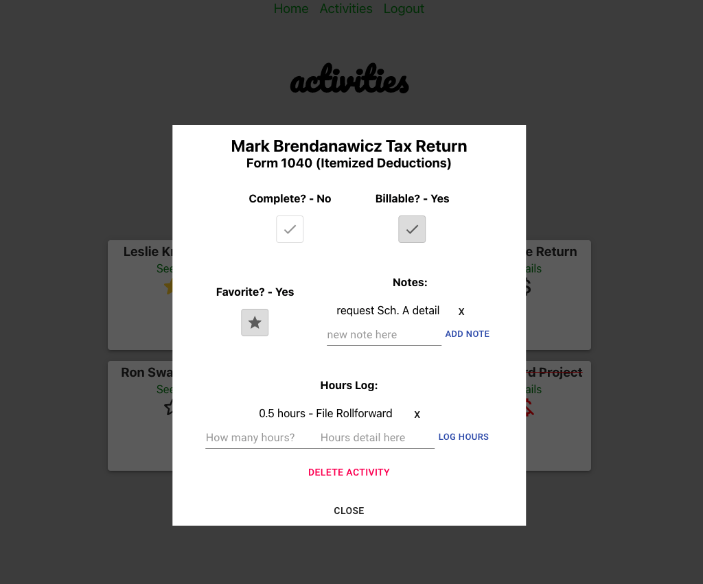

# aliveline

"the crunchtime manager for accountants"

## Purpose

*aliveline* is an app designed for individuals in the accounting profession who need a better way to track the tasks on their plate. The "system" of the pen-and-paper to-do list is no more with *aliveline*, which brings customizable job tracking from your desk to your computer screen. With *aliveline*, you get robust note-taking and hour-tracking in a beautiful, but powerful card-based interface. The user also maintains the same old satisfaction of crossing through jobs as they are completed!

## Why *aliveline*?

As a former tax accountant, I was often required a juggle and prioritize dozens of tasks at once. I never found a fully digital, but effective way to track the jobs on my plate, and often reached for a note pad for my "to-dos", which was not as convenient and accessible as a digital medium. Therefore, I created *aliveline* to address this problem.

## Features

### Core Functionality

- Secure login/logout.
- Create new activities to complete, which appear as a new card in your list.
- Include an activity title and details upon creation.
- Easily reference all jobs in one place upon login.
- Mark cards "complete".
- Delete cards all together to keep your workspace clean.

### Secondary Features

- Mark jobs as "billable" or "non-billable" to prioritize tasks.
- Mark cards as "favorite" to add a secondary method of prioritization.
- Update each card's "Notes" and "Hours Log" section with appropriate data for each job as work continues.
- Delete each Note or Hours entry.

## Development

### Quick Facts

- *aliveline* is a full-stack CRUD web app and SPA.
- *PERN* Stack: Postgres, Express, React, Node
- Third-party authentication service: Auth0

### Backend Technologies

- PostgreSQL (ElephantSQL)
- Node.js
- Express
- pg-promies
- cors (node dependency)
- Model & Controller integration to create a custom JSON API
- Deployed on Heroku
- [See Backend Repo](https://github.com/john-manack/aliveline-front)

### Frontend Technologies

- React, with all functional components with hooks to manage state and API calls
- Controlled form inputs with state
- React Router
- Styled with material-ui and vanilla CSS
- Auth0 (SPA package)
- Component testing using React test utilities
- Deployed on netlify
- [See Frontend Repo](https://github.com/john-manack/aliveline-back)

## Screenshots

Home Page

Activities Page

Add An Activity

Update An Activity

## Links

[Live Site](https://aliveline.netlify.app/)
[Developer](https://www.linkedin.com/in/john-manack/)
